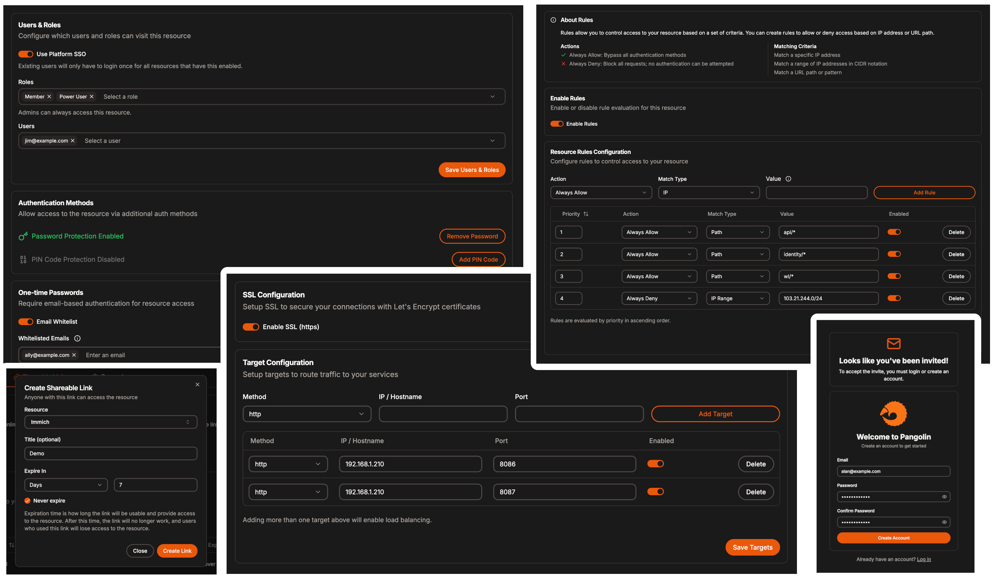

    <h2>
      <picture>
          <source media="(prefers-color-scheme: dark)" srcset="public/logo/word_mark_white.png">
          
        </picture>
    </h2>

<h4 align="center">Tunneled Reverse Proxy Server with Access Control</h4>

_Your own self-hosted zero trust tunnel._

  <h5>
      <a href="https://fossorial.io">
        Website
      </a>
       | 
      <a href="https://docs.fossorial.io/Getting%20Started/quick-install">
        Install Guide
      </a>
       | 
      <a href="mailto:numbat@fossorial.io">
        Contact Us
      </a>
  </h5>

Pangolin is a self-hosted tunneled reverse proxy server with identity and access control, designed to securely expose private resources on distributed networks. Acting as a central hub, it connects isolated networks — even those behind restrictive firewalls — through encrypted tunnels, enabling easy access to remote services without opening ports.

_Resources page of Pangolin dashboard (dark mode) showing multiple resources available to connect._

## Key Features

### Reverse Proxy Through WireGuard Tunnel

- Expose private resources on your network **without opening ports** (firewall punching).
- Secure and easy to configure site-to-site connectivity via a custom **user space WireGuard client**, [Newt](https://github.com/fosrl/newt).
- Built-in support for any WireGuard client.
- Automated **SSL certificates** (https) via [LetsEncrypt](https://letsencrypt.org/).
- Support for HTTP/HTTPS and **raw TCP/UDP services**.
- Load balancing.

### Identity & Access Management

- Centralized authentication system using platform SSO. **Users will only have to manage one login.**
- **Define access control rules for IPs, IP ranges, and URL paths per resource.**
- TOTP with backup codes for two-factor authentication.
- Create organizations, each with multiple sites, users, and roles.
- **Role-based access control** to manage resource access permissions.
- Additional authentication options include:
    - Email whitelisting with **one-time passcodes.**
    - **Temporary, self-destructing share links.**
    - Resource specific pin codes.
    - Resource specific passwords.
- External identity provider (IdP) support with OAuth2/OIDC, such as Authentik, Keycloak, Okta, and others.
    - Auto-provision users and roles from your IdP.

### Simple Dashboard UI

- Manage sites, users, and roles with a clean and intuitive UI.
- Monitor site usage and connectivity.
- Light and dark mode options.
- Mobile friendly.

### Easy Deployment

- Run on any cloud provider or on-premises.
- **Docker Compose based setup** for simplified deployment.
- Future-proof installation script for streamlined setup and feature additions.
- Use any WireGuard client to connect, or use **Newt, our custom user space client** for the best experience.
- Use the API to create custom integrations and scripts.
    - Fine-grained access control to the API via scoped API keys.
    - Comprehensive Swagger documentation for the API.

### Modular Design

- Extend functionality with existing [Traefik](https://github.com/traefik/traefik) plugins, such as [CrowdSec](https://plugins.traefik.io/plugins/6335346ca4caa9ddeffda116/crowdsec-bouncer-traefik-plugin) and [Geoblock](https://github.com/PascalMinder/geoblock).
    - **Automatically install and configure Crowdsec via Pangolin's installer script.**
- Attach as many sites to the central server as you wish.

## Deployment and Usage Example

1. **Deploy the Central Server**:

    - Deploy the Docker Compose stack onto a VPS hosted on a cloud platform like RackNerd, Amazon EC2, DigitalOcean Droplet, or similar. There are many cheap VPS hosting options available to suit your needs.

> [!TIP]
> Many of our users have had a great experience with [RackNerd](https://my.racknerd.com/aff.php?aff=13788). Depending on promotions, you can get a [**VPS with 1 vCPU, 1GB RAM, and ~20GB SSD for just around $12/year**](https://my.racknerd.com/aff.php?aff=13788&pid=912). That's a great deal!
> We are part of the [RackNerd](https://my.racknerd.com/aff.php?aff=13788) affiliate program, so if you purchase through [our link](https://my.racknerd.com/aff.php?aff=13788), we receive a small commission which helps us maintain the project and keep it free for everyone.

1. **Domain Configuration**:

    - Point your domain name to the VPS and configure Pangolin with your preferred settings.

2. **Connect Private Sites**:

    - Install Newt or use another WireGuard client on private sites.
    - Automatically establish a connection from these sites to the central server.

3. **Expose Resources**:

    - Add resources to the central server and configure access control rules.
    - Access these resources securely from anywhere.

**Use Case Example - Bypassing Port Restrictions in Home Lab**:  
 Imagine private sites where the ISP restricts port forwarding. By connecting these sites to Pangolin via WireGuard, you can securely expose HTTP and HTTPS resources on the private network without any networking complexity.

**Use Case Example - Deploying Services For Your Business**:
You can use Pangolin as an easy way to expose your business applications to your users behind a safe authentication portal you can integrate into your IdP solution. Expose resources on prem and on the cloud.

**Use Case Example - IoT Networks**:  
 IoT networks are often fragmented and difficult to manage. By deploying Pangolin on a central server, you can connect all your IoT sites via Newt or another WireGuard client. This creates a simple, secure, and centralized way to access IoT resources without the need for intricate networking setups.

## Similar Projects and Inspirations

**Cloudflare Tunnels**:  
 A similar approach to proxying private resources securely, but Pangolin is a self-hosted alternative, giving you full control over your infrastructure.

**Authelia**:  
 This inspired Pangolin’s centralized authentication system for proxies, enabling robust user and role management.

## Project Development / Roadmap

> [!NOTE]
> Pangolin is under heavy development. The roadmap is subject to change as we fix bugs, add new features, and make improvements.

View the [project board](https://github.com/orgs/fosrl/projects/1) for more detailed info.

## Licensing

Pangolin is dual licensed under the AGPL-3 and the Fossorial Commercial license. Please see the [LICENSE](./LICENSE) file in the repository for details. For inquiries about commercial licensing, please contact us at [numbat@fossorial.io](mailto:numbat@fossorial.io).

## Contributions

Please see [CONTRIBUTING](./CONTRIBUTING.md) in the repository for guidelines and best practices.

Please post bug reports and other functional issues in the [Issues](https://github.com/fosrl/pangolin/issues) section of the repository.
For all feature requests, or other ideas, please use the [Discussions](https://github.com/orgs/fosrl/discussions) section.
