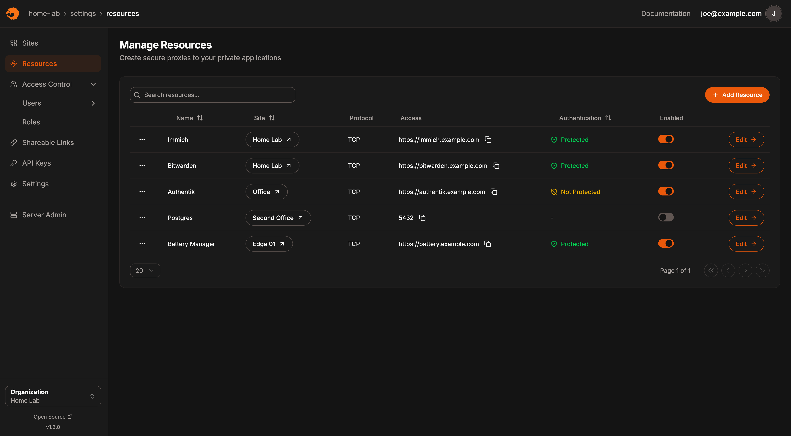
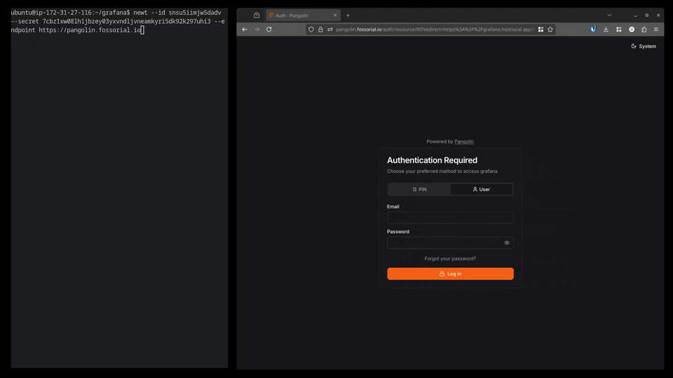
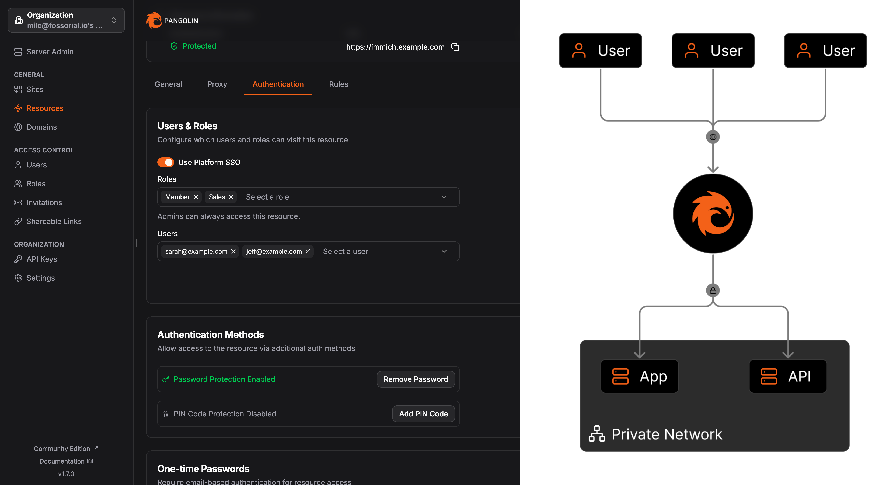
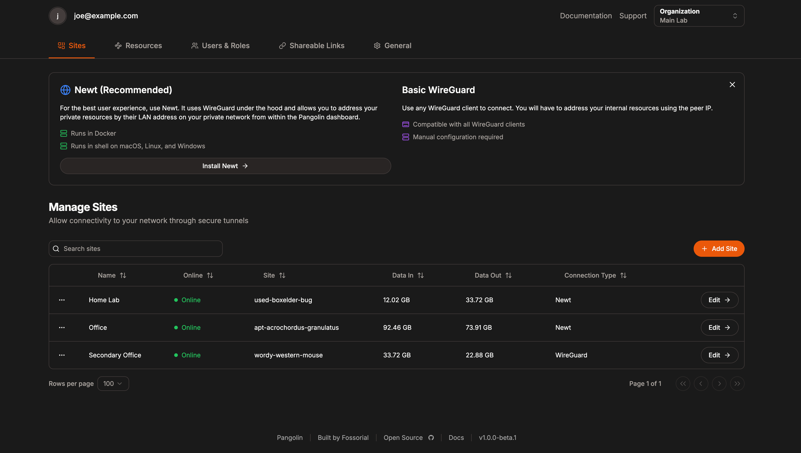

    <h2>
      <picture>
          <source media="(prefers-color-scheme: dark)" srcset="public/logo/word_mark_white.png">
          
        </picture>
    </h2>

<h4 align="center">Secure gateway to your private networks</h4>

_Pangolin tunnels your services to the internet so you can access anything from anywhere._

  <h5>
      <a href="https://digpangolin.com">
        Website
      </a>
       | 
      <a href="https://docs.fossorial.io/Getting%20Started/quick-install">
        Install Guide
      </a>
       | 
      <a href="mailto:numbat@fossorial.io">
        Contact Us
      </a>
  </h5>

    <strong>
        Start testing Pangolin at <a href="https://pangolin.fossorial.io/auth/signup">pangolin.fossorial.io</a>
    </strong>

Pangolin is a self-hosted tunneled reverse proxy server with identity and access control, designed to securely expose private resources on distributed networks. Acting as a central hub, it connects isolated networks — even those behind restrictive firewalls — through encrypted tunnels, enabling easy access to remote services without opening ports.

## Key Features

### Reverse Proxy Through WireGuard Tunnel

- Expose private resources on your network **without opening ports** (firewall punching).
- Secure and easy to configure private connectivity via a custom **user space WireGuard client**, [Newt](https://github.com/fosrl/newt).
- Built-in support for any WireGuard client.
- Automated **SSL certificates** (https) via [LetsEncrypt](https://letsencrypt.org/).
- Support for HTTP/HTTPS and **raw TCP/UDP services**.
- Load balancing.
- Extend functionality with existing [Traefik](https://github.com/traefik/traefik) plugins, such as [CrowdSec](https://plugins.traefik.io/plugins/6335346ca4caa9ddeffda116/crowdsec-bouncer-traefik-plugin) and [Geoblock](https://github.com/PascalMinder/geoblock).
    - **Automatically install and configure Crowdsec via Pangolin's installer script.**
- Attach as many sites to the central server as you wish.

### Identity & Access Management

- Centralized authentication system using platform SSO. **Users will only have to manage one login.**
- **Define access control rules for IPs, IP ranges, and URL paths per resource.**
- TOTP with backup codes for two-factor authentication.
- Create organizations, each with multiple sites, users, and roles.
- **Role-based access control** to manage resource access permissions.
- Additional authentication options include:
    - Email whitelisting with **one-time passcodes.**
    - **Temporary, self-destructing share links.**
    - Resource specific pin codes.
    - Resource specific passwords.
    - Passkeys
- External identity provider (IdP) support with OAuth2/OIDC, such as Authentik, Keycloak, Okta, and others.
    - Auto-provision users and roles from your IdP.

## Use Cases

### Manage Access to Internal Apps

- Grant users access to your apps from anywhere using just a web browser. No client software required.

### Developers and DevOps

- Expose and test internal tools and dashboards like **Grafana**. Bring localhost or private IPs online for easy access.

### Secure API Gateway

- One application load balancer across multiple clouds and on-premises.

### IoT and Edge Devices

- Easily expose **IoT devices**, **edge servers**, or **Raspberry Pi** to the internet for field equipment monitoring.

## Deployment Options

### Fully Self Hosted

Host the full application on your own server or on the cloud with a VPS. Take a look at the [documentation](https://docs.fossorial.io/Getting%20Started/quick-install) to get started.

> Many of our users have had a great experience with [RackNerd](https://my.racknerd.com/aff.php?aff=13788). Depending on promotions, you can get a [**VPS with 1 vCPU, 1GB RAM, and ~20GB SSD for just around $12/year**](https://my.racknerd.com/aff.php?aff=13788&pid=912). That's a great deal!

### Pangolin Cloud

Easy to use with simple [pay as you go pricing](https://digpangolin.com/pricing). [Check it out here](https://pangolin.fossorial.io/auth/signup). 

- Everything you get with self hosted Pangolin, but fully managed for you.

### Hybrid & High Availability

Managed control plane, your infrastructure

- We manage database and control plane.
- You self-host lightweight exit-node.
- Traffic flows through your infra.
- We coordinate failover between your nodes or to Cloud when things go bad.

If interested, [contact us](mailto:numbat@fossorial.io).

### Full Enterprise On-Premises

[Contact us](mailto:numbat@fossorial.io) for a full distributed and enterprise deployments on your infrastructure controlled by your team.

## Project Development / Roadmap

We want to hear your feature requests! Add them to the [discussion board](https://github.com/orgs/fosrl/discussions/categories/feature-requests).

## Licensing

Pangolin is dual licensed under the AGPL-3 and the Fossorial Commercial license. For inquiries about commercial licensing, please contact us at [numbat@fossorial.io](mailto:numbat@fossorial.io).

## Contributions

Looking for something to contribute? Take a look at issues marked with [help wanted](https://github.com/fosrl/pangolin/issues?q=is%3Aissue%20state%3Aopen%20label%3A%22help%20wanted%22).

Please see [CONTRIBUTING](./CONTRIBUTING.md) in the repository for guidelines and best practices.

Please post bug reports and other functional issues in the [Issues](https://github.com/fosrl/pangolin/issues) section of the repository.
