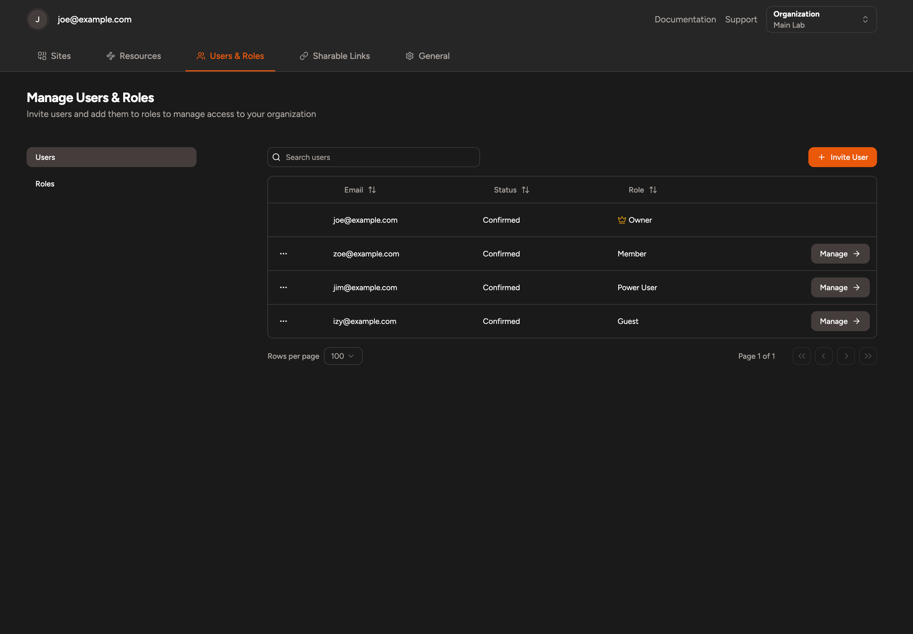
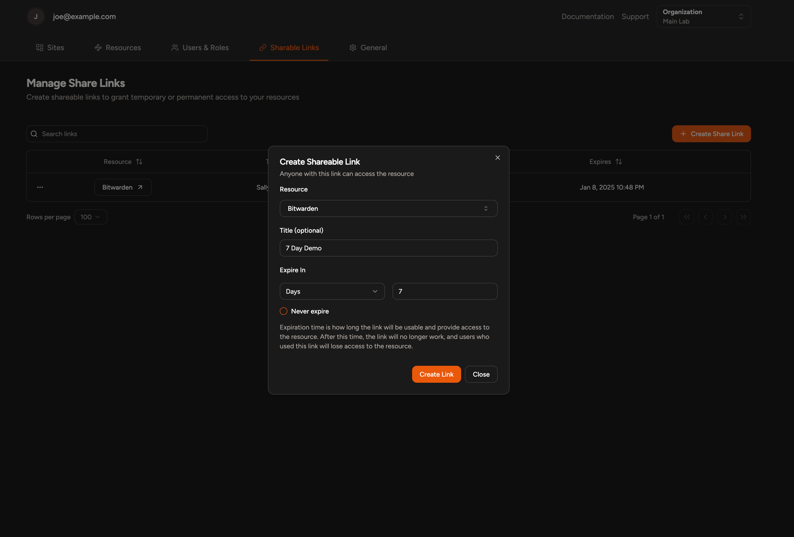
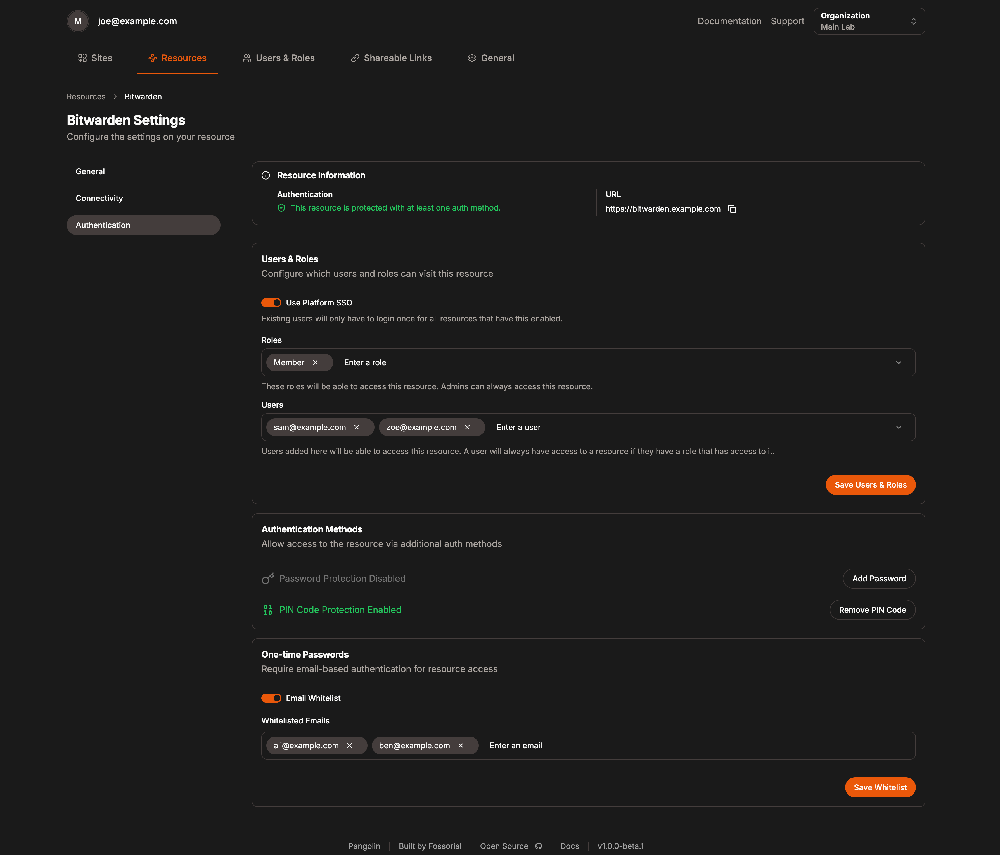
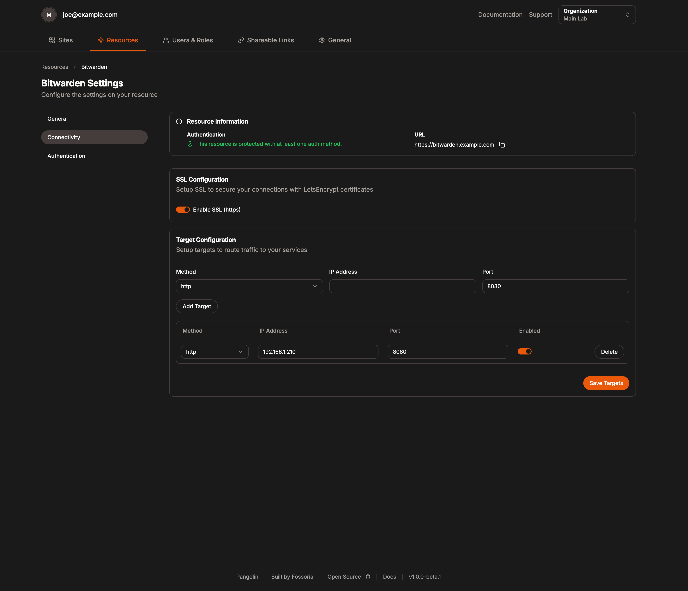

# Pangolin

Pangolin is a self-hosted tunneled reverse proxy management server with identity and access management, designed to securely expose private resources through use with the Traefik reverse proxy and WireGuard tunnel clients like Newt. With Pangolin, you retain full control over your infrastructure while providing a user-friendly and feature-rich solution for managing proxies, authentication, and access, and simplifying complex network setups, all with a clean and simple UI.

### Installation and Documentation

-   [Installation Instructions](https://docs.fossorial.io/Getting%20Started/quick-install)
-   [Full Documentation](https://docs.fossorial.io)

## Preview

_Sites page of Pangolin showing multiple site-to-site tunnels connected to the central server._

## Key Features

### Reverse Proxy Through WireGuard Tunnel

-   Expose private resources on your network **without opening ports**.
-   Secure and easy to configure site-to-site connectivity via a custom **user space WireGuard client**, [Newt](https://github.com/fosrl/newt).
-   Built-in support for any WireGuard client.
-   Automated **SSL certificates** (https) via [LetsEncrypt](https://letsencrypt.org/).

### Identity & Access Management

-   Centralized authentication system using platform SSO. **Users will only have to manage one login.**
-   Totp with backup codes for two-factor authentication.
-   Create organizations, each with multiple sites, users, and roles.
-   **Role-based access control** to manage resource access permissions.
-   Additional authentication options include:
    -   Email whitelisting with **one-time passcodes.**
    -   **Temporary, self-destructing share links.**
    -   Resource specific pin codes.
    -   Resource specific passwords.

### Simple Dashboard UI

-   Manage sites, users, and roles with a clean and intuitive UI.
-   Monitor site usage and connectivity.
-   Light and dark mode options.
-   Mobile friendly.

### Easy Deployment

-   Docker Compose based setup for simplified deployment.
-   Future-proof installation script for streamlined setup and feature additions.
-   Run on any VPS.
-   Use your preferred WireGuard client to connect, or use Newt, our custom user space client for the best experience.

### Modular Design

-   Extend functionality with existing [Traefik](https://github.com/traefik/traefik) plugins, such as [Fail2Ban](https://plugins.traefik.io/plugins/628c9ebcffc0cd18356a979f/fail2-ban) or [CrowdSec](https://plugins.traefik.io/plugins/6335346ca4caa9ddeffda116/crowdsec-bouncer-traefik-plugin), which integrate seamlessly.
-   Attach as many sites to the central server as you wish.

## Screenshots

Pangolin has a straightforward and simple dashboard UI:

  <table>
  <tr>
      <td align="center"></td>
      <td align="center"></td>
      <td align="center"></td>
    </tr>
    <tr>
      <td align="center"><b>Sites</b></td>
      <td align="center"><b>Users</b></td>
      <td align="center"><b>Share Link</b></td>
    </tr>
    <tr>
      <td align="center"></td>
      <td align="center"></td>
      <td align="center"></td>
    </tr>
    <tr>
      <td align="center"><b>Authentication</b></td>
      <td align="center"><b>Connectivity</b></td>
      <td align="center"><b></b></td>
    </tr>
  </table>

## Workflow Example

### Deployment and Usage Example

1. **Deploy the Central Server**:

    - Deploy the Docker Compose stack containing Pangolin, Gerbil, and Traefik onto a VPS hosted on a cloud platform like Amazon EC2, DigitalOcean Droplet, or similar. There are many cheap VPS hosting options available to suit your needs.

2. **Domain Configuration**:

    - Point your domain name to the VPS and configure Pangolin with your preferred settings.

3. **Connect Private Sites**:
    - Install Newt or use another WireGuard client on private sites.
    - Automaticlaly establish a connection from these sites to the central server.
4. **Configure Users & Roles**
    - Define organizations and invite users.
    - Implement user- or role-based permissions to control resource access.

**Use Case Example - Bypassing Port Restrictions in Home Lab**:  
 Imagine private sites where the ISP restricts port forwarding. By connecting these sites to Pangolin via WireGuard, you can securely expose HTTP and HTTPS resources on the private network without any networking complexity.

**Use Case Example - IoT Networks**:  
 IoT networks are often fragmented and difficult to manage. By deploying Pangolin on a central server, you can connect all your IoT sites via Newt or another WireGuard client. This creates a simple, secure, and centralized way to access IoT resources without the need for intricate networking setups.

## Similar Projects and Inspirations

Pangolin was inspired by several existing projects and concepts:

-   **Cloudflare Tunnels**:  
    A similar approach to proxying private resources securely, but Pangolin is a self-hosted alternative, giving you full control over your infrastructure.

-   **Authentik and Authelia**:  
    These projects inspired Pangolin’s centralized authentication system for proxies, enabling robust user and role management.

## Licensing

Pangolin is dual licensed under the AGPLv3 and the Fossorial Commercial license. For inquiries about commercial licensing, please contact us.

## Contributions

Please see [CONTRIBUTIONS](./CONTRIBUTING.md) in the repository for guidelines and best practices.
